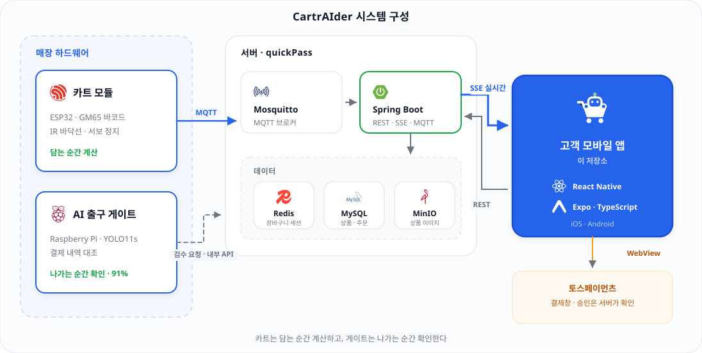
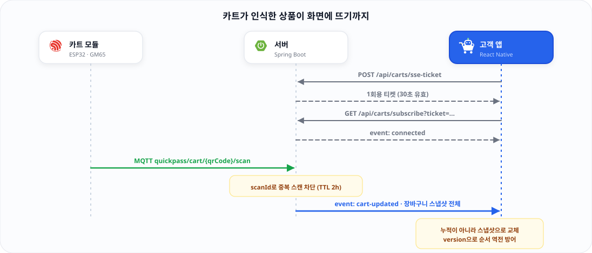

<div align="center">


### 스마트폰과 연동되는 카트 부착형 스마트카트 — 고객용 모바일 앱

**“카트는 담는 순간 계산하고, 게이트는 나가는 순간 확인한다”**

<br />

     

</div>

---

## 무엇을 푸는가

마트 계산대 앞의 대기줄과, 셀프계산 확산 이후 늘어난 상품 손실을 **함께** 해결합니다.

|  | 문제 | CartrAIder의 답 |
|---|---|---|
| 🕒 | 계산대 병목 — 소비자 39%가 긴 줄 때문에 구매를 포기한 경험 | 쇼핑 중에 담으면서 결제까지 끝낸다 |
| 📉 | 셀프계산 환경의 상품 손실 | 나가는 길목에서 AI가 결제 내역과 대조한다 |
| 💸 | 기존 스마트카트는 카트 본체에 화면·카메라·배터리를 모두 통합 → 도입비 부담 | **전용 카트 교체 없이** 기존 카트에 부착, 화면은 고객 스마트폰을 쓴다 |

## 두 개의 모듈

<table>
<tr>
<td width="50%" valign="top">

###  카트 모듈 — ESP32
기존 카트에 부착

- **바코드 스캔 → 실시간 장바구니**<br/>GM65가 상품을 인식하고 MQTT로 서버에 전송, 앱에 즉시 반영
- **바닥선 인식 → 카트 정지**<br/>IR 센서가 경계선을 인식하면 서보모터로 정지

→ *계산대 대기 제거 + 구역 이탈 방지*

</td>
<td width="50%" valign="top">

###  AI 출구 게이트 — Raspberry Pi
매장 출구에 설치

- **카메라 상품 인식**<br/>YOLO11s 파인튜닝 모델로 카트 속 상품 인식 (정확도 91%)
- **결제 내역 대조**<br/>인식 결과를 서버의 결제 내역과 비교해 통과 여부 판정

→ *스캔 누락 · 미결제 상품 검수*

</td>
</tr>
</table>

> **이 저장소는 위 그림의 “고객용 모바일 앱”입니다.** 앱은 Spring Boot 단일 서버([quickPass](https://github.com/CartrAIder/quickPass))하고만 통신하며, MQTT·AI 파이프라인은 서버 안쪽 이야기라 앱은 알지 못합니다.

## 시스템 아키텍처

<div align="center">
  
</div>

### 앱이 쓰는 통신 3종

| 방향 | 방식 | 쓰는 곳 |
|---|---|---|
| 앱 → 서버 | **REST** | 카트 연결, 수량 변경·삭제, 주문 생성, 결제 승인 |
| 서버 → 앱 | **SSE** | 담긴 상품·합계 실시간 수신 *(WebSocket 미사용)* |
| 앱 ↔ 토스 | **WebView** | 결제창. 성공/실패 리다이렉트를 가로채 결과만 받는다 |

## 실시간 장바구니가 도는 방식

카트가 상품을 인식한 순간부터 화면에 뜨기까지입니다.

<div align="center">
  
</div>

SSE는 헤더를 실을 수 없어 **1회용 티켓**으로 인증합니다. 서버는 변경분이 아니라 **장바구니 전체 스냅샷**을 내려주고, 앱은 통째로 교체하되 버전 번호로 늦게 도착한 옛 데이터가 최신을 덮어쓰지 않게 막습니다. 끊기면 1초 → 2초 → 4초로 늘려가며 새 티켓을 받아 다시 붙습니다.

## 화면 구성

| 화면 | 기능 | 통신 |
|---|---|---|
| 로그인 / 회원가입 | 이메일 인증(6자리) → 가입 → 모바일 로그인 | REST |
| 홈 | 허브 — 쇼핑 시작·이어하기, 오늘의 할인, 메뉴 | REST |
| 카트 연결 | QR 스캔 또는 코드 직접 입력 | REST |
| **장바구니** | 담긴 상품·합계 실시간, 수량 ±·삭제·반납 | **SSE** + REST |
| 결제 확인 | 주문 생성 → 결제 시도 → 토스 결제창 | REST + WebView |
| 결제 완료 | 출구 게이트용 QR + 영수증, 사진 앨범 저장 | — |
| 상품 보기 / 상세 | 검색·구역 필터·정렬, 가격·재고·매대 위치 | REST |
| 매장 지도 | SVG 평면도, 매대 구역별 상품 | — |
| 마이페이지 | 내 정보·구매 내역·접근성 설정 | REST |
| 관리자 | 상품 등록/수정, 주문 조회, 매대 배치 편집 | REST |

## 접근성 — 일반인 / 노약자 모드

전역 `ModeContext`의 `mode: 'normal' | 'senior'`(기본 `normal`). 토글은 로그인 화면과 마이페이지에 있습니다.
**두 모드의 기능은 100% 동일**하고, 화면도 한 벌만 만듭니다. 스타일 값은 전부 `theme[mode]` 토큰에서 읽습니다.

| 요소 | normal | senior |
|---|---|---|
| 본문 / 버튼 / 금액 | 15 / 18 / 20pt | **18 / 24 / 30pt** |
| 터치 영역 최소 높이 | 44px | **56px** |
| 색 대비 | 표준 | **WCAG AA (4.5:1)** |
| 상품 그리드 | 2열 | **1열** (글자 잘림 방지) |
| 음성 안내 | — | 상품 담김 · 결제 완료 |

## 성능

상품 40종 기준으로 측정한 값입니다.

| 항목 | 이전 | 현재 |
|---|---:|---:|
| 상품 이미지 총 전송량 | 68.2 MB | **1.43 MB** |
| 이미지 장당 평균 | 1,847 KB | **37 KB** |
| 앱 시작 프리페치 | 40장 (68 MB) | **12장 (~450 KB)** |
| 요청당 보안저장소 접근 | 매 요청 | **앱 실행당 1회** |
| 카탈로그 저장 I/O | 키 십수 개 순차 | **단일 키** |

- 원본 PNG(1024~1920px)를 **WebP 1000px**로 재인코딩해 전송량을 48배 줄였습니다.
- 목록 이미지는 `expo-image`의 메모리+디스크 캐시와 우선순위를 사용하고, 프리페치는 첫 화면 분량만 받습니다.
- 카탈로그 캐시는 민감정보가 아니므로 `async-storage` 단일 키에 두고, **토큰만** `secure-store`에 남깁니다.

## 기술 스택

| 기술 | 역할 |
|---|---|
| React Native 0.86 + Expo SDK 57 | 크로스플랫폼 앱 기반 |
| Expo Router | 파일 기반 라우팅 (`src/app/`) |
| TypeScript (strict) | 전체 타입 적용 |
| Context + useReducer | 전역 상태 (인증·카탈로그·카트·모드) |
| Custom fetch wrapper | JWT 자동 첨부 · 401 자동 재발급 · 에러 공통 처리 |
| `react-native-sse` | SSE 폴리필 (RN에는 `EventSource`가 없다) |
| `react-native-webview` | 토스페이먼츠 결제창 |
| `react-native-reanimated` | 스켈레톤 shimmer · 장바구니/결제 연출 |
| `react-native-keyboard-controller` | 입력창 키보드 회피 (안드로이드 포함) |
| `react-native-svg` | 매장 평면도 · QR |
| `expo-camera` / `expo-secure-store` | QR 스캔 / 토큰 보관 |
| `expo-speech` / `expo-haptics` | 음성 안내 / 촉각 피드백 |

**의도적으로 쓰지 않는 것**: Axios · TanStack Query · Zustand · Redux · WebSocket

## 시작하기

```bash
npm install
npx expo start --port 8082 -c
```

루트에 `.env`를 만듭니다. 실기기에서 접속하려면 `localhost` 대신 **맥의 LAN IP**를 씁니다.

```bash
EXPO_PUBLIC_API_BASE_URL=http://<백엔드-IP>:8081
EXPO_PUBLIC_USE_MOCK=false
```

> 백엔드 저장소의 `./set-ip.sh`가 앱·서버 양쪽 주소를 현재 IP로 한 번에 맞춰줍니다.
> `EXPO_PUBLIC_*`는 번들에 박히는 값이라 IP를 바꿨다면 반드시 `-c`(캐시 비우기)로 재시작해야 합니다.

### APK 빌드

```bash
eas build --platform android --profile preview
```

`preview` 프로필은 배포 서버(HTTPS)를 바라봅니다. 로컬 백엔드를 보는 `lan` 프로필로 릴리스 APK를 만들면 안드로이드가 평문 HTTP를 차단하므로 `usesCleartextTraffic` 설정이 따로 필요합니다.

## 폴더 구조

```
src/
├─ app/                    # 라우트 (expo-router)
│  ├─ login · signup · home · mypage
│  ├─ connect · cart · checkout · complete
│  ├─ products · product/[id] · map · orders
│  └─ admin/               # 관리자 (라우트 가드)
├─ components/             # Card · PrimaryButton · TextField · StoreMap
│  ├─ TossPaymentModal     # 결제 WebView (앱 스킴 처리 포함)
│  ├─ Skeleton             # shimmer 로딩 자리
│  └─ AnimatedWon          # 금액 카운트업
├─ context/                # Auth · Catalog · CartSession · Cart · Mode
├─ theme/tokens.ts         # normal / senior 두 벌
└─ lib/
   ├─ api.ts               # fetch wrapper + 전 엔드포인트
   ├─ sse.ts               # 실시간 장바구니 구독
   ├─ catalog/overlay.ts   # 서버 상품 + 로컬 표현 병합
   └─ *Storage.ts          # 세션 · 카트 · 카탈로그 저장
```

### 하이브리드 카탈로그

백엔드 `Product`는 `barcode · name · price · category · status` 다섯 개뿐이라, 매대 구역·아이콘·할인·재고 같은 **표현 레이어는 앱이 바코드 기준 오버레이로 얹어** 병합합니다. 고객 화면과 관리자 화면이 같은 병합 결과를 봅니다.

## 브랜드

<div align="center">

</div>

카트에 손을 얹고 탑승한 AI 로봇 마스코트. 워드마크는 Plus Jakarta Sans, `AI`만 굵게 강조합니다.

| 역할 | HEX | 쓰이는 곳 |
|---|---|---|
| Primary | `#2563EB` | 브랜드·CTA·강조 |
| Primary (senior) | `#1D4ED8` | 고대비 모드 |
| Accent | `#16A34A` | 안테나·성공 상태 |
| Ink | `#111827` | 본문·워드마크 |

에셋 원본과 사용 규칙은 [`assets/README.md`](assets/README.md)에 있습니다.

## 팀

**팀 카트라이더** — 인천대학교 창의공학설계

김도영 · 김준성 · 박서현 · 박찬혁 · 백수연 · 이현서 · 최수환 · 최지환 · 홍승혁

프론트엔드(이 저장소): **최수환, 김도영** · 백엔드: [`CartrAIder/quickPass`](https://github.com/CartrAIder/quickPass)

<div align="center">
<br />

</div>
