<div align="center">


### 스마트폰과 연동되는 카트 부착형 스마트카트 — 고객용 모바일 앱

**“카트는 담는 순간 계산하고, 게이트는 나가는 순간 확인한다”**

<br />

     

<sub>프로젝트 전체 소개 → <a href="https://github.com/CartrAIder">github.com/CartrAIder</a></sub>

</div>

---

## 카트가 읽으면, 이 앱이 보여준다

<table>
<tr>
<td width="34%" align="center">

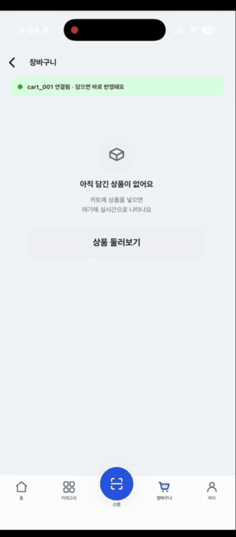

</td>
<td width="66%" valign="middle">

카트 손잡이의 바코드 리더가 상품을 읽으면 **MQTT → 서버 → SSE**를 거쳐 이 화면에 뜹니다.
왼쪽은 실제 시연 영상에서 앱 화면만 잘라낸 것입니다 — 손으로 담기만 했고, 앱은 아무것도 누르지 않았습니다.

- 빈 장바구니 → 감자깡 ₩1,500 → 티오 아이스티까지 **₩10,470**
- 담길 때마다 토스트 + 하단 합계 + 탭 배지가 같이 움직입니다
- 카트에는 화면이 없습니다. **이 앱이 카트의 화면입니다**

<sub>전체 시연 영상 → <a href="https://github.com/CartrAIder/.github/raw/main/profile/media/demo-full.mp4">demo-full.mp4 (3분)</a></sub>

</td>
</tr>
</table>

## 이 저장소가 맡은 자리

<div align="center">
  
</div>

앱은 Spring Boot 단일 서버([quickPass](https://github.com/CartrAIder/quickPass))하고만 통신합니다.
카트 모듈(ESP32)·AI 출구 게이트(Raspberry Pi)·MQTT 파이프라인은 **서버 안쪽 이야기라 앱은 알지 못합니다.**
앱이 아는 것은 "서버가 내려주는 장바구니 스냅샷"뿐입니다.

| 방향 | 방식 | 쓰는 곳 |
|---|---|---|
| 앱 → 서버 | **REST** | 카트 연결, 수량 변경·삭제, 주문 생성, 결제 승인, 회원/관리자 |
| 서버 → 앱 | **SSE** | 담긴 상품·합계 실시간 수신 *(WebSocket 미사용)* |
| 앱 ↔ 토스 | **WebView** | 결제창. 성공/실패 리다이렉트를 가로채 결과만 받는다 |

---

## 화면

### 고객

<table>
<tr>
<td align="center" width="14.2%">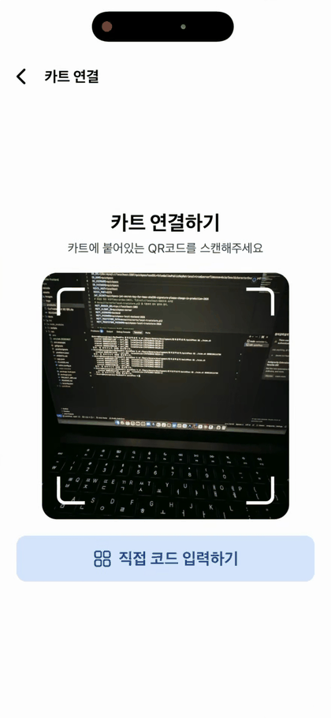</td>
<td align="center" width="14.2%">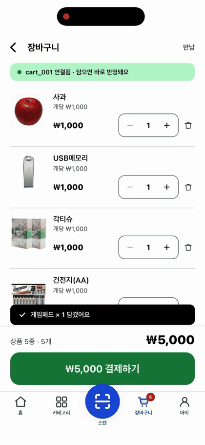</td>
<td align="center" width="14.2%">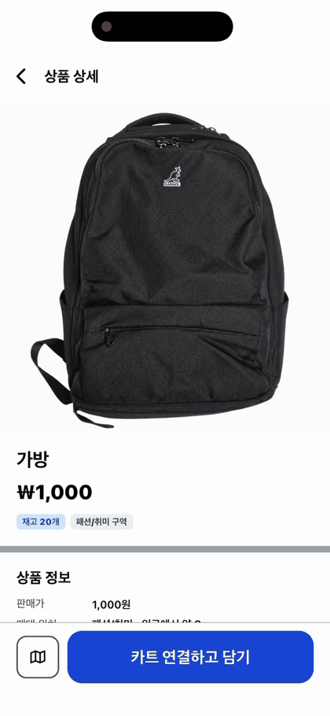</td>
<td align="center" width="14.2%">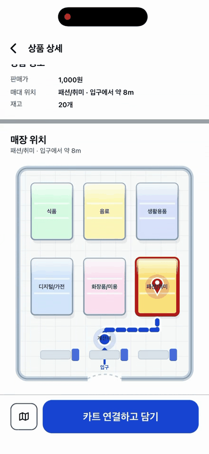</td>
<td align="center" width="14.2%">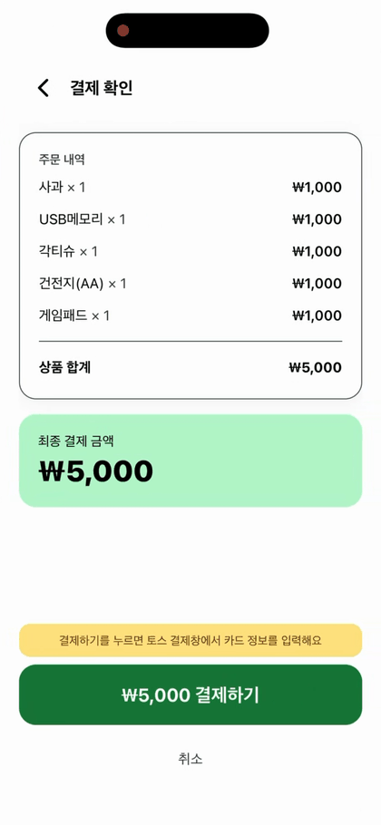</td>
<td align="center" width="14.2%">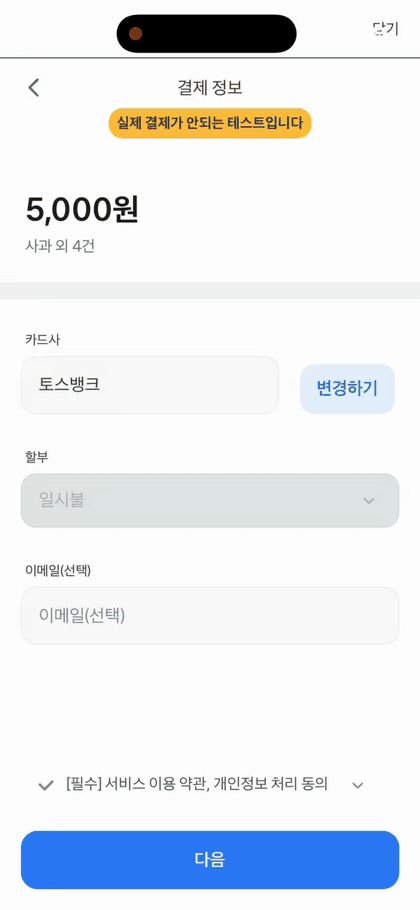</td>
<td align="center" width="14.2%">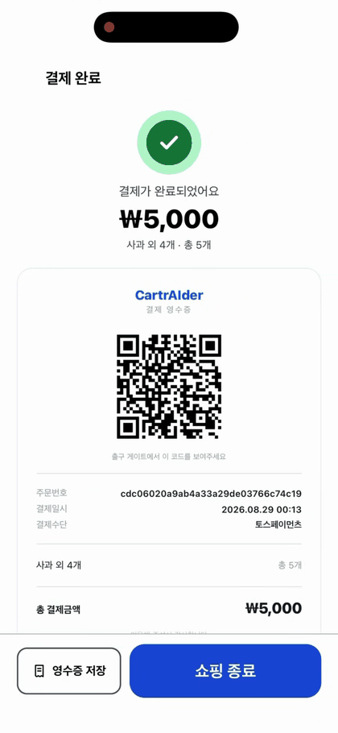</td>
</tr>
<tr>
<td align="center"><sub><b>카트 연결</b><br/>QR·코드 입력</sub></td>
<td align="center"><sub><b>장바구니</b><br/>SSE 실시간</sub></td>
<td align="center"><sub><b>상품 상세</b><br/>가격·재고</sub></td>
<td align="center"><sub><b>매대 위치</b><br/>SVG 평면도</sub></td>
<td align="center"><sub><b>결제 확인</b><br/>주문 생성</sub></td>
<td align="center"><sub><b>토스 결제창</b><br/>WebView</sub></td>
<td align="center"><sub><b>결제 완료</b><br/>출구 QR</sub></td>
</tr>
</table>

로그인 / 회원가입(이메일 6자리 인증) · 홈 허브 · 상품 보기(검색·구역 필터·정렬) · 구매 내역 ·
마이페이지 · 비밀번호 찾기/변경 · 회원 탈퇴까지 **라우트 23개**가 모두 구현돼 있습니다.

### 관리자

<table>
<tr>
<td align="center" width="20%">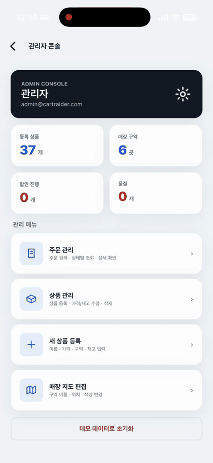</td>
<td align="center" width="20%">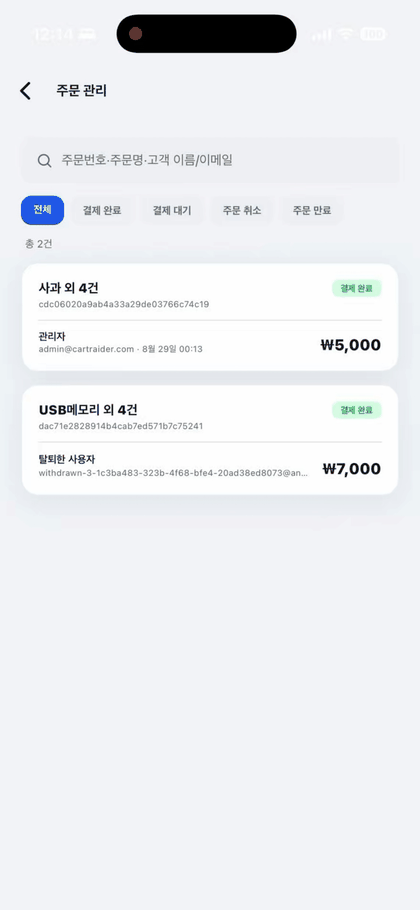</td>
<td align="center" width="20%">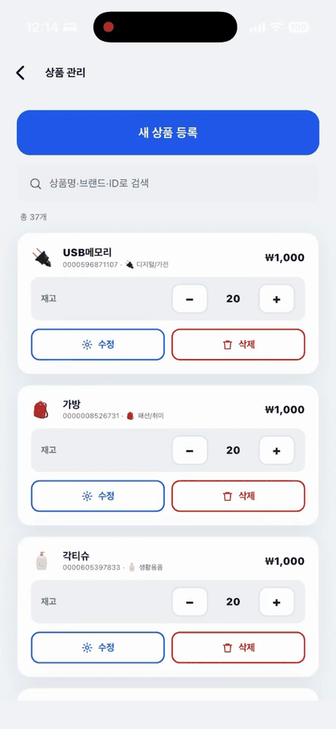</td>
<td align="center" width="20%">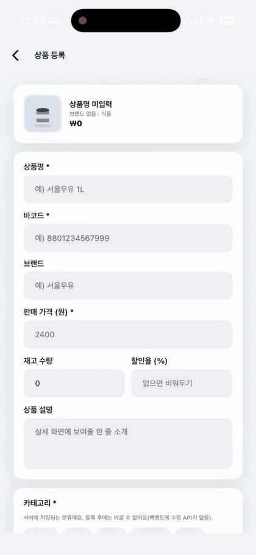</td>
<td align="center" width="20%">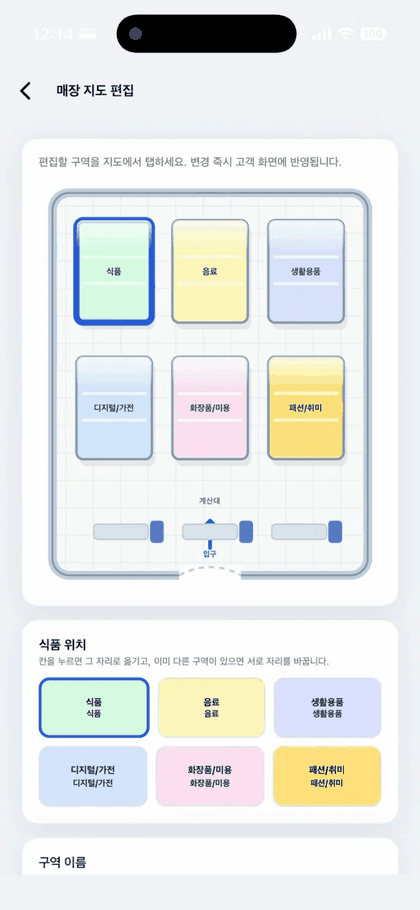</td>
</tr>
<tr>
<td align="center"><sub><b>대시보드</b><br/>통계·경고</sub></td>
<td align="center"><sub><b>주문 관리</b><br/>검색·상태 필터</sub></td>
<td align="center"><sub><b>상품 관리</b><br/>재고 ±·수정·삭제</sub></td>
<td align="center"><sub><b>상품 등록</b><br/>등록/수정 공용 폼</sub></td>
<td align="center"><sub><b>지도 편집</b><br/>구역 배치 스왑</sub></td>
</tr>
</table>

관리자 화면은 **별도 앱이 아니라 같은 앱의 `/admin` 라우트**입니다.
`role`은 로그인 시 받은 액세스 토큰(JWT)의 클레임에서 읽고, 진입점은 `isAdmin`일 때만 보이며,
딥링크 대비로 `app/admin/_layout.tsx`가 라우트 가드를 한 번 더 겁니다. **앱에 하드코딩된 관리자 계정은 없습니다.**

---

## 실시간 장바구니가 도는 방식

카트가 상품을 인식한 순간부터 화면에 뜨기까지입니다.

<div align="center">
  
</div>

RN에는 `EventSource`가 없어 [`react-native-sse`](https://github.com/binaryminds/react-native-sse) 폴리필을 씁니다.
그 위에 네 가지를 직접 얹었습니다.

| 문제 | 해법 | 위치 |
|---|---|---|
| SSE는 요청 헤더를 못 실어 JWT를 못 보낸다 | `POST /api/carts/sse-ticket`으로 **1회용 티켓(30초)** 을 받아 쿼리로 넘긴다 | [`lib/sse.ts`](src/lib/sse.ts) |
| 티켓은 한 번 쓰면 끝이라 EventSource 내장 자동재연결이 같은 URL을 계속 재시도한다 | `pollingInterval: 0`으로 내장 재연결을 끄고, **새 티켓을 받아 직접 다시 구독**한다 (1s → 2s → 4s … 최대 10s) | [`lib/sse.ts`](src/lib/sse.ts) |
| 변경분(delta)을 쌓으면 한 번만 놓쳐도 합계가 영영 틀어진다 | 서버가 **장바구니 전체 스냅샷**을 내려주고 앱은 통째로 교체한다 | [`context/CartContext.tsx`](src/context/CartContext.tsx) |
| 교체 방식은 늦게 도착한 옛 스냅샷이 최신을 덮어쓸 수 있다 | 스냅샷의 `version`이 반영본보다 낮으면 **리듀서가 그대로 버린다** | [`CartContext.tsx:76`](src/context/CartContext.tsx#L76) |

수량 ± · 삭제는 **낙관적 업데이트**로 화면에 먼저 반영하고 REST로 통보합니다.
서버는 처리 후 다시 스냅샷을 밀어주므로, 낙관적 반영이 틀렸으면 그 스냅샷이 정정합니다.
재접속 때는 SSE `cart-init`과 별개로 `GET /api/carts/current`도 한 번 부르는데,
둘 중 늦게 온 쪽은 `version` 비교에서 알아서 걸러집니다.

> 스캔 중복은 앱이 아니라 **카트 쪽에서** 막습니다. 스캔마다 고유한 `scanId`를 붙여 보내기 때문에
> 네트워크 오류로 재전송돼도 서버가 같은 스캔으로 보고 무시합니다(TTL 2시간).

---

## 앱 구조

```
src/
├─ app/                    # 라우트 23개 (expo-router · 파일 기반)
├─ components/             # Card · PrimaryButton · TextField · StoreMap · TossPaymentModal …
├─ context/                # 전역 상태 5개
├─ theme/tokens.ts         # normal / senior 두 벌
└─ lib/                    # api · sse · storage · catalog
```

전체 **TypeScript strict**, 약 13,700줄 / 62개 파일입니다.

### 전역 상태 — Context 5개

Redux도 Zustand도 없습니다. 상태가 다섯 덩어리로 딱 갈리고 서로 거의 안 섞여서,
`Context + useReducer`로 충분했습니다.

| Context | 소유하는 것 | 영속화 |
|---|---|---|
| `ModeContext` | `mode: 'normal' \| 'senior'` + 현재 모드의 디자인 토큰 | secure-store |
| `AuthContext` | 회원 세션 (JWT · refresh · `role`) | secure-store |
| `CartSessionContext` | 카트 연결(`qrCode`) 세션 — 회원 세션과 **분리** | secure-store |
| `CartContext` | 장바구니 items · SSE 연결 상태 · 마지막 스캔 | secure-store |
| `CatalogContext` | 상품·매대 구역 (고객 화면과 관리자 화면이 공유) | async-storage |

회원 세션과 카트 세션을 분리한 덕에 **앱을 껐다 켜도 쇼핑을 이어서** 할 수 있습니다
(홈의 "쇼핑 계속하기"). 로그아웃해도 카트 연결은 남고, 카트를 반납해도 로그인은 유지됩니다.

### 네트워크 — `lib/api.ts` 한 파일

Axios도 TanStack Query도 쓰지 않습니다. 대신 `fetch` 래퍼 하나가 이것들을 전부 맡습니다.

- **JWT 자동 첨부** — 모든 요청에 secure-store의 액세스 토큰을 붙인다
- **401 → 자동 재발급 → 원 요청 재시도** — refresh 토큰으로 한 번만 재발급하고 같은 요청을 그대로 다시 보낸다.
  재시도 요청에는 `retrying=true`를 줘 무한 루프를 막는다
- **동시 401 합치기** — 화면 하나가 API를 서너 개 동시에 부르면 401도 동시에 온다.
  `reissueOnce()`가 진행 중인 재발급 Promise를 공유해 **재발급은 딱 한 번만** 돈다
- **세션 만료 브리지** — `apiFetch`는 React 밖(모듈 스코프)이라 `AuthContext`를 직접 못 부른다.
  `setOnSessionExpired()`로 콜백을 등록해 두고, refresh까지 죽으면 **자동 로그아웃 + 로그인 화면 이동**을 통지한다.
  중복 알림은 플래그로 1회만
- **`ApiError { status, code }`** — 화면이 문자열이 아니라 서버 `ErrorCode`(`CART_PAYMENT_PENDING` 등)로 분기한다
- **10초 타임아웃 + 사람 말 에러** — `AbortController`로 끊고, `Network request failed` 대신
  "서버에 연결할 수 없어요. 네트워크 연결을 확인해주세요."로 바꾼다
- **선검증** — 비밀번호 규칙(영문·숫자·특수문자 8~20자)을 백엔드 정규식과 **같은 판정**으로 클라이언트에서 먼저 본다

```ts
// 401 → 재발급 → 재시도. 동시 다발 401은 reissueOnce가 하나로 합친다.
if (res.status === 401 && !retrying) {
  const refreshed = session?.refreshToken ? await reissueOnce() : null;
  if (refreshed) return apiFetch<T>(path, init, true);
  notifySessionExpired();
}
```

---

## 접근성 — 일반인 / 노약자 모드

전역 `ModeContext`의 `mode: 'normal' | 'senior'`(기본 `normal`). 토글은 로그인 화면과 마이페이지에 있습니다.
**두 모드의 기능은 100% 동일**하고, **화면도 한 벌만** 만듭니다.
스타일 값은 전부 `theme[mode]` 토큰에서 읽고, 화면 코드에 폰트 크기·색·그림자·radius를 하드코딩하지 않습니다.

| 요소 | normal | senior |
|---|---|---|
| 본문 / 버튼 / 금액 | 15 / 18 / 20pt | **18 / 24 / 30pt** |
| 터치 영역 최소 높이 | 44px | **56px** |
| 색 대비 | 표준 | **WCAG AA (4.5:1)** · Primary `#2563EB` → `#1D4ED8` |
| 카드 경계 | 은은한 그림자 | **진한 테두리** (그림자는 저시력에서 잘 안 보인다) |
| 상품 그리드 | 2열 | **1열** (글자 잘림 방지) |
| 터치 물결(ripple) | 옅게 | **진하게** (눌린 게 확실히 보이도록) |
| 음성 안내 | — | 상품 담김 · 결제 완료 (`expo-speech`) |

화면을 두 벌 만들지 않은 게 핵심입니다. 두 벌이면 기능을 고칠 때마다 두 번 고쳐야 하고,
한쪽만 고쳐지는 순간 "노약자 모드는 기능이 다른 앱"이 됩니다.

---

## 성능

상품 40종 기준으로 측정한 값입니다.

| 항목 | 이전 | 현재 |
|---|---:|---:|
| 상품 이미지 총 전송량 | 68.2 MB | **1.43 MB** |
| 이미지 장당 평균 | 1,847 KB | **37 KB** |
| 앱 시작 프리페치 | 40장 (68 MB) | **12장 (~450 KB)** |
| 요청당 보안저장소 접근 | 매 요청 | **앱 실행당 1회** |
| 카탈로그 저장 I/O | 키 십수 개 순차 | **단일 키** |

- 원본 PNG(1024~1920px)를 **WebP 1000px**로 재인코딩해 전송량을 48배 줄였습니다.
- 목록 이미지는 `expo-image`의 **메모리+디스크 캐시**(`cachePolicy: 'memory-disk'`)를 씁니다.
  RN 기본 `Image`는 디스크 캐시가 사실상 없어 화면을 옮길 때마다 다시 받습니다.
- 프리페치는 **첫 화면에 실제로 보이는 12장만** 받습니다. 전량을 받으면 로그인 화면이 떠 있는 동안
  상품 수에 비례해 내려받게 되고, 느린 망에서 첫 화면이 그만큼 늦어집니다. 나머지는 스크롤할 때 알아서 캐시됩니다.
- 상품 목록은 **로그인 전에 미리** 받습니다(`/api/products`는 permitAll). TLS 핸드셰이크(첫 요청 +0.7초)를
  로그인 버튼을 누르기 전에 미리 치러 두고, 로그인 직후 홈이 바로 그려집니다.
- 카탈로그 캐시는 민감정보가 아니므로 `async-storage` **단일 키**에 두고, **토큰만** `secure-store`에 남깁니다.

---

## 하이브리드 카탈로그

백엔드 `Product`는 `barcode · name · price · category · status` 다섯 개뿐입니다.
그런데 앱에는 매대 구역 지도, 상품 아이콘, 할인 연출, 재고 표시가 있습니다.

그래서 **표현 레이어는 앱이 바코드 기준 오버레이로 얹어** 병합합니다([`lib/catalog/overlay.ts`](src/lib/catalog/overlay.ts)).

```
서버 Product (barcode·name·price·category·status)
        +
로컬 오버레이 (zone·icon·stock·discount)     ← 카테고리에서 파생, 관리자 편집분이 덮어씀
        ↓
화면이 쓰는 Product
```

- 백엔드 카테고리 14종 → 앱 매대 구역 6종으로 매핑합니다(`FOOD·SNACK·FRUIT…` → `food`).
  **백엔드가 카테고리를 늘리면 여기도 채워야** 지도와 구역 필터가 살아 있습니다. 빠뜨리면 전부 한 매대로 몰립니다.
- 재고는 0 여부만 판매 상태(`ON_SALE`/`SOLD_OUT`)로 서버에 전달됩니다.
- **고객 화면과 관리자 화면이 같은 병합 결과를 봅니다.** 화면에서 `mock/products.ts`를 직접 import하지 않고
  `useCatalog()`를 쓰는 이유입니다 — mock 배열은 최초 1회 채우는 시드일 뿐입니다.

---

## 결제 — 토스페이먼츠 WebView

Expo Go에서 돌려야 해서 네이티브 SDK 대신 **인라인 HTML + 토스 JS SDK를 WebView에 띄웁니다**
([`components/TossPaymentModal.tsx`](src/components/TossPaymentModal.tsx)).

1. 서버에서 클라이언트 키를 받아 WebView 안에서 토스를 초기화하고 `requestPayment` 호출
2. 결제가 끝나면 토스가 `successUrl` / `failUrl`로 리다이렉트 → **실제로 이동시키지 않고 URL만 가로채** `paymentKey`를 꺼낸다
3. 앱이 `POST /api/payments/confirm`으로 서버에 승인 요청 → **승인 판정은 서버가 한다**

까다로웠던 건 **앱 스킴**입니다. 토스 결제창은 카드사 앱이나 토스 앱으로 넘어가려 하는데,
안드로이드는 `intent://` URL을 씁니다. RN의 `Linking`은 이걸 그대로 못 열어서, 직접 파싱합니다.

```
intent://pay?...#Intent;scheme=supertoss;package=viva.republica.toss;S.browser_fallback_url=https%3A%2F%2F...;end
             └ scheme으로 원래 앱 주소 복원 ┘ └ 앱이 없으면 fallback URL / 스토어 이동 ┘
```

`http(s)`·`about:blank`·`data:` 만 WebView가 직접 열게 두고, 나머지는 전부 앱 스킴으로 보고 OS에 넘깁니다.

결제가 끝나면 완료 화면이 **출구 게이트용 QR**을 그리고(`react-native-qrcode-svg`),
영수증 카드를 `react-native-view-shot`으로 캡처해 사진 앨범에 저장합니다.

> `expo-media-library`는 SDK 57부터 최상위 진입점이 클래스 기반 새 API로 바뀌었고 Expo Go에 없는 네이티브
> 모듈을 import 시점에 요구합니다(화면 진입 자체가 죽습니다). 저장 하나만 쓰므로 `expo-media-library/legacy`를 명시적으로 import합니다.

---

## 매장 지도 — SVG 한 벌

매장 평면도는 [`components/StoreMap.tsx`](src/components/StoreMap.tsx) **하나만** 씁니다.
매장 지도 화면 · 상품 상세의 위치 표시 · 관리자 지도 편집이 같은 컴포넌트를 공유하고,
좌표 상수(`COL_X` · `ROW_Y` · `buildRoute`)도 이 파일에서 export합니다.
매대는 **2행 × 3열 = 6칸** 고정이라, 구역 추가·이동은 이 6칸 안에서만 일어납니다.

---

## 기술 스택

| 기술 | 역할 |
|---|---|
| React Native 0.86 + Expo SDK 57 | 크로스플랫폼 앱 기반 |
| Expo Router | 파일 기반 라우팅 (`src/app/`) |
| TypeScript (strict) | 전체 타입 적용 |
| Context + useReducer | 전역 상태 (인증·카탈로그·카트세션·카트·모드) |
| Custom fetch wrapper | JWT 자동 첨부 · 401 자동 재발급 · 에러 공통 처리 |
| `react-native-sse` | SSE 폴리필 (RN에는 `EventSource`가 없다) |
| `react-native-webview` | 토스페이먼츠 결제창 |
| `react-native-reanimated` | 스켈레톤 shimmer · 장바구니/결제 연출 |
| `react-native-keyboard-controller` | 입력창 키보드 회피 (안드로이드 포함) |
| `react-native-svg` | 매장 평면도 · QR |
| `expo-image` | 상품 이미지 (메모리+디스크 캐시 · 프리페치 · 우선순위) |
| `expo-camera` / `expo-secure-store` | QR 스캔 / 토큰 보관 |
| `expo-speech` / `expo-haptics` | 음성 안내 / 촉각 피드백 |
| `react-native-view-shot` / `expo-media-library` | 영수증 캡처 / 앨범 저장 |

**의도적으로 쓰지 않는 것**

| 안 쓰는 것 | 이유 |
|---|---|
| Axios | fetch 래퍼 한 파일로 충분하다 (의존성 없이 재발급·타임아웃까지 처리) |
| TanStack Query | 실시간은 SSE가, 나머지는 mutation 몇 개뿐이라 캐시 레이어가 남는다 |
| Zustand / Redux | 상태가 다섯 덩어리로 갈려 거의 안 섞인다 |
| WebSocket | 서버 → 앱 단방향이면 충분하다. 양방향은 재연결·하트비트를 우리가 떠안게 된다 |

---

## 시작하기

```bash
npm install
npx expo start --port 8082 -c
```

루트에 `.env`를 만듭니다. 실기기에서 접속하려면 `localhost` 대신 **맥의 LAN IP**를 씁니다.

```bash
EXPO_PUBLIC_API_BASE_URL=http://<백엔드-IP>:8081
EXPO_PUBLIC_USE_MOCK=false
```

> 백엔드 저장소의 `./set-ip.sh`가 앱·서버 양쪽 주소를 현재 IP로 한 번에 맞춰줍니다.
> `EXPO_PUBLIC_*`는 번들에 박히는 값이라 IP를 바꿨다면 반드시 `-c`(캐시 비우기)로 재시작해야 합니다.

`EXPO_PUBLIC_USE_MOCK=true`면 카트 연결·장바구니가 mock으로 돕니다.
`lib/sse.ts`의 mock 스트림이 상품 7개를 0.9초 간격으로 "인식"시켜, **백엔드 없이도 실시간 화면을 그대로 볼 수 있습니다.**

### APK 빌드

```bash
eas build --platform android --profile preview
```

| 프로필 | 바라보는 서버 |
|---|---|
| `lan` | 로컬 백엔드 (맥 LAN IP) — 개발 중 실기기 테스트 |
| `preview` | 배포 서버 HTTPS — 시연용 APK |
| `production` | 배포 서버 HTTPS — AAB |

> 로컬 백엔드를 보는 `lan` 프로필로 **릴리스** APK를 만들면 안드로이드가 평문 HTTP를 차단하므로
> `usesCleartextTraffic` 설정이 따로 필요합니다.

---

## 폴더 구조

```
src/
├─ app/                    # 라우트 (expo-router)
│  ├─ login · signup · password-reset · password-change · withdraw
│  ├─ home · mypage · orders · order/[orderId]
│  ├─ connect · cart · checkout · complete
│  ├─ products · product/[id] · map
│  └─ admin/               # 관리자 (라우트 가드)
│     ├─ index · orders · order/[orderId]
│     └─ products · product-form · map
├─ components/             # Card · PrimaryButton · TextField · AppBar · BottomTabBar
│  ├─ StoreMap             # 매장 평면도 SVG (지도·상세·관리자 공용)
│  ├─ TossPaymentModal     # 결제 WebView (앱 스킴 처리 포함)
│  ├─ ProductImage         # 서버 사진 → 번들 사진 → 벡터 폴백 3단
│  ├─ Skeleton             # shimmer 로딩 자리
│  └─ AnimatedWon          # 금액 카운트업
├─ context/                # Mode · Auth · CartSession · Cart · Catalog
├─ theme/tokens.ts         # normal / senior 두 벌
└─ lib/
   ├─ api.ts               # fetch wrapper + 전 엔드포인트
   ├─ sse.ts               # 실시간 장바구니 구독 (+ mock 스트림)
   ├─ catalog/overlay.ts   # 서버 상품 + 로컬 표현 병합
   ├─ productArt.ts        # 이름 해시 기반 벡터 그림 (최후 폴백)
   ├─ speak.ts             # 음성 안내 (senior)
   └─ *Storage.ts          # 세션 · 카트 · 카탈로그 저장
```

## 브랜드

<div align="center">

</div>

카트에 손을 얹고 탑승한 AI 로봇 마스코트. 워드마크는 Plus Jakarta Sans, `AI`만 굵게 강조합니다.

| 역할 | HEX | 쓰이는 곳 |
|---|---|---|
| Primary | `#2563EB` | 브랜드·CTA·강조 |
| Primary (senior) | `#1D4ED8` | 고대비 모드 |
| Accent | `#16A34A` | 안테나·성공 상태 |
| Ink | `#111827` | 본문·워드마크 |

에셋 원본과 사용 규칙은 [`assets/README.md`](assets/README.md)에 있습니다.

---

## 팀

**팀 카트라이더** — 인천대학교 창의공학설계 · 지도교수 컴퓨터공학부 이장호 교수님

| 파트 | 담당 |
|---|---|
| **프론트엔드** *(이 저장소)* | 김도영 [@kimdoyoung1110](https://github.com/kimdoyoung1110) · 최수환 |
| **백엔드** — [`quickPass`](https://github.com/CartrAIder/quickPass) | 최지환 [@greenpig759](https://github.com/greenpig759) |
| **AI** — [`cartAider_ai_server`](https://github.com/CartrAIder/cartAider_ai_server) | 홍승혁 [@snwfld00](https://github.com/snwfld00) |
| **하드웨어** — 카트 모듈 · 출구 게이트 | 김준성 [@newplayerkim](https://github.com/newplayerkim) · 박찬혁 [@chanhyuk282](https://github.com/chanhyuk282) · 백수연 · 이현서 [@mrlee1009](https://github.com/mrlee1009) |
| **보조** | 박서현 [@shpark0305](https://github.com/shpark0305) |

<div align="center">
<br />

</div>
